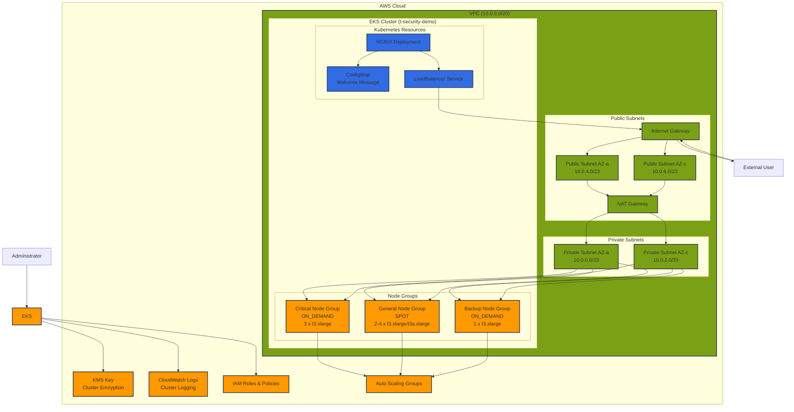

### T Security Demo

**Architecture:**

```mermaid
graph TD
   subgraph AWS Cloud
       subgraph VPC ["VPC (10.0.0.0/20)"]
           subgraph Public Subnets
               PS1[Public Subnet AZ-a<br>10.0.4.0/23]
               PS2[Public Subnet AZ-c<br>10.0.6.0/23]
               NAT[NAT Gateway]
               IGW[Internet Gateway]
           end
           
           subgraph Private Subnets
               PRS1[Private Subnet AZ-a<br>10.0.0.0/23]
               PRS2[Private Subnet AZ-c<br>10.0.2.0/23]
           end

           subgraph "EKS Cluster (t-security-demo)"
               subgraph "Node Groups"
                   NG1[Critical Node Group<br>ON_DEMAND<br>3 x t3.xlarge]
                   NG2[General Node Group<br>SPOT<br>2-4 x t3.xlarge/t3a.xlarge]
                   NG3[Backup Node Group<br>ON_DEMAND<br>1 x t3.xlarge]
               end

               subgraph "Kubernetes Resources"
                   NGINX[NGINX Deployment]
                   CM[ConfigMap<br>Welcome Message]
                   SVC[LoadBalancer Service]
               end
           end
       end

       KMS[KMS Key<br>Cluster Encryption]
       CW[CloudWatch Logs<br>Cluster Logging]
       IAM[IAM Roles & Policies]
       ASG[Auto Scaling Groups]
   end

   User[External User]
   Admin[Administrator]

   IGW --> User
   User --> IGW
   IGW --> PS1 & PS2
   PS1 & PS2 --> NAT
   NAT --> PRS1 & PRS2
   PRS1 & PRS2 --> NG1 & NG2 & NG3
   
   Admin --> EKS
   
   NGINX --> CM
   NGINX --> SVC
   SVC --> IGW
   
   EKS --> KMS
   EKS --> CW
   EKS --> IAM
   NG1 & NG2 & NG3 --> ASG

   classDef aws fill:#FF9900,stroke:#232F3E,stroke-width:2px;
   classDef k8s fill:#326CE5,stroke:#232F3E,stroke-width:2px;
   classDef network fill:#7AA116,stroke:#232F3E,stroke-width:2px;
   
   class IGW,NAT,VPC,PS1,PS2,PRS1,PRS2 network;
   class EKS,NG1,NG2,NG3,KMS,CW,IAM,ASG aws;
   class NGINX,CM,SVC k8s;
```
